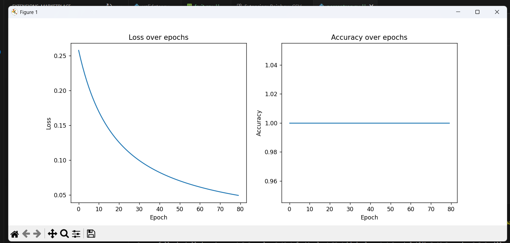

# Assignment Submission Summary

This repository contains solutions and deliverables for a series of tasks related to natural language processing, machine learning, and AI concepts.

---

## Q1: Tokenisation & Fill-in-the-Blank

- **Description:**  
  Tokenized a sample sentence using three different tokenization algorithms — BPE, WordPiece, and SentencePiece (Unigram).  
  Implemented a mask-filling exercise using a pre-trained model (`bert-base-uncased`) from the Hugging Face transformers library to predict masked tokens in the sentence.  
- **Files:**  
  - `tokenisation_fill_mask.py` — Python script performing tokenization and fill-mask predictions.  
- **Key Points:**  
  - Explored differences in token splits among tokenization methods.  
  - Displayed top-3 predictions for masked tokens with commentary on plausibility.

---

## Q2: Hallucination Detection & Guardrails

- **Description:**  
  Built a simple hallucination detection system that checks model-generated answers against a knowledge base (KB).  
  Used string matching to validate answers and implemented retry logic for mismatches or out-of-domain questions.  
- **Files:**  
  - `kb.json` — JSON file containing 10 factual question-answer pairs.  
  - `ask_model.py` — Script that queries a dummy model with questions.  
  - `validator.py` — Validates answers against KB and determines if retries are needed.  
  - `run.log` — Log file containing questions asked and model answers.  
  - `summary.md` — Summary report of model performance and validation results.  
- **Key Points:**  
  - Demonstrated basic guardrails to reduce hallucinations using KB validation.  
  - Provided retry mechanism to improve answer accuracy.

---

## Q3: Perceptron From Scratch

- **Description:**  
  Created a dataset `fruit.csv` with features `length_cm`, `weight_g`, `yellow_score`, and labels for apples (0) and bananas (1).  
  Implemented a single-neuron logistic regression model using pure NumPy, trained via batch gradient descent for ≥ 500 epochs or until loss < 0.05.  
  Plotted loss and accuracy per epoch to visualize training progress.  
- **Files:**  
  - `fruit.csv` — Dataset with ≥ 12 rows for training.  
  - `perceptron.py` — Python script implementing logistic regression and training loop.  
  - `reflection.md` — Reflection on model training results, learning rate impact, and analogy with DJ knob/child learning.  
- **Training Results:**  
  - Model converged early (around epoch 79) with loss decreasing and accuracy reaching 100%.  
  - Loss decreased steadily, showing improved confidence in predictions.  
  - Accuracy was consistently high, indicating good separation of classes.  
- **Graphs:**  
    
  *(Replace with your actual screenshot file path)*

---

## General Notes

- All Python scripts require Python ≥ 3.10.  
- Used Matplotlib for plotting graphs.  
- Dependencies are listed in `requirements.txt`.  
- Reflections mention AI assistance where applicable to maintain academic integrity.  

---

## How to Run

1. Install dependencies:

```bash
pip install -r requirements.txt
```

2. Run Q1 tokenization and fill-mask:

```bash
python tokenisation_fill_mask.py
```

3. Run Q2 hallucination detection:

```bash
python ask_model.py
```

4. Run Q3 perceptron training:

```bash
python perceptron.py
```

Graphs will be displayed upon training completion.

---

Thank you for reviewing my submission. Please feel free to reach out if you have any questions or need clarifications.

---

*Prepared by: Hemant Acharya*  
*Date: June 2025*
